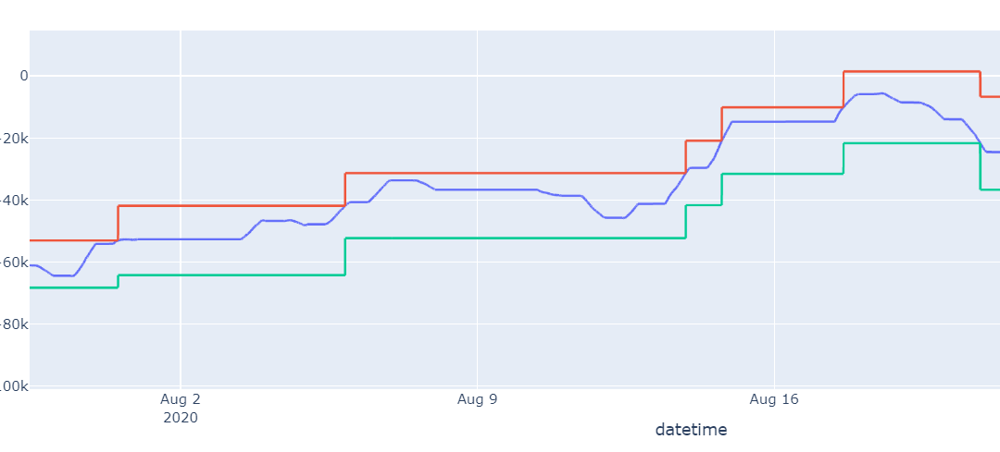
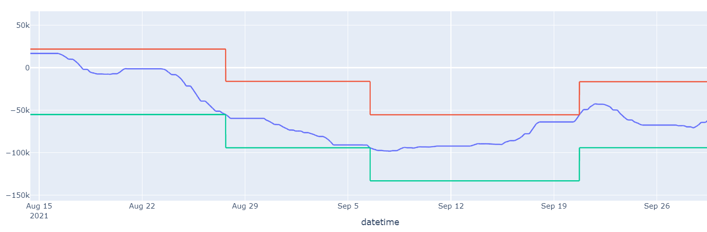
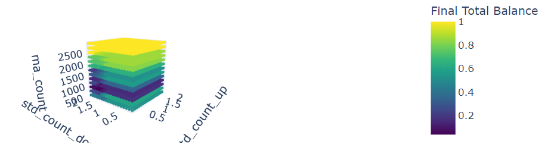
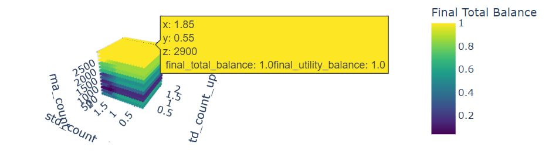

# Проект "Торговля против физиков на Фондовом Рынке"

## Предпосылки проекта:

С лета этого года МосБиржа позволяет получать данные соотношения лонг и шорт позиций на фьючерсы  различных акций (и не только)  у физических и юридических лиц по отдельности (раньше Мосбиржа требовала за эту информацию 5К$). 
Мы хотим проверить, можно ли получить прибыльную стратегию (прибыльнее, чем рынок), торгуя против против физиков. 


## Реализация проекта:

### Подготовка данных:

Сначала требуется получить данные по позициям, а затем по ценам базовых активов (изначально мы хотели торговать фьючерсами, однако данные МосБиржи по позициям указаны за все фьючерсы, а не за какой-то с конкретной датой экспирация, а цены за фьючерсы МосБиржа отображает как цену фьючерса с самым близким к дате временем экспирации, поэтому использовать цены дериватива будет некорректно). 

Для получения данных мы используем файлы: Parser_future_fiz_yur.ipynb и Parser_Price_asset.ipynb. Устроены они по одному алгоритму (во втором файле реализовано параллельное скачивание), программа собирает последовательно все дни из предоставленного промежутка (собираем именно день, так как так удобно, вообще можно было бы собирать 3 дня, но тогда бы приходилось бы дополнительно обрабатывать данные, что уменьшало бы производительность), а затем соединяем их в один большой DataFrame и сохраняем в виде .csv файла. В программе предусмотрено, что МосБиржа может в какой-то момент отказать в доступе (например, часто бывала такая ошибка: "превышено время ожидания"), если такое произойдёт, то программа сохранит те данные, что уже есть и при повторном запуске проверяет присутствующие дни и начнёт с последнего сохраненного. 

### Класс задаваемых стратегий:

Наши стратегии берут данные по позициям (до того дня, на котором сейчас "находится"). Так как мы имеем данные за каждые 5 минут, а цены только за каждый день, чтобы ребалансировка не происходила часто мы используем скользящие средние с некоторым параметром. 

Начинаем мы с того, что стратегия высчитывает вариацию и домножая ее на STD_COUNT_UP в случае верхней границы и STD_COUNT_DOWN в случае нижней, строит диапозон. При пересечении нижней границы диапозона открываем шорт и пересчитываем диапозон. Если пересечём нижнюю границу ещё раз, то просто пересчитаем диапазон. Если верхнюю, то закроем шорт и пересчитаем диапазон. С лонгом аналогично: при пересечении верхней границы открывается лонг. Пересекая верхную ещё раз лонг продолжается, при пересечения нижней - позиция закрывается.


##### Параметры стратегий
 
RISK: параметр риска(). $\textit{RISK = 1, так как он предназначался для построения портфеля акций, но мы это не реализовали}$

STD_COUNT_UP, STD_COUNT_DOWN: коэффициенты для расчета границ скользящей средней.

MA_COUNT: ширина окна для построения скользящей средней.


##### Вывод
Результат выполнения стратегии записывается в массив, содержащий информацию о времени, цене актива, балансе пользователя (доходность стратегии пользователя), типе позиции, границах скользящей средней и флагах покупки/продажи.

##### Пример использования
```
train_data, test_data = clear_data('sr') # clear_data возвращает два датафрейма с данными о активе

strategy = Strategy(train_data, 10000000)
df = pd.DataFrame(strategy.run(1, 1, 1, 500))
```
Лонг: Траектория ударилась в верхнюю границу. Открылся лонг. Диапазон пересчитался. Дальше она несколько раз бьет верхнюю границу. Там только диапазон пересчитывается. В конце она пересекает нижнюю  границу и Лонг закрывается (То есть это жизнь одного Лонга от открытия до закрытия).


Шорт:


#### Возникающие проблемы:

Мы хотим оптимизировать параметры, о которых написали выше, для этого мы берем исторические данные и прогоняем наши стратегии с разными начальными параметрами, параметры мы просто задаём через range с некоторым шагом (мы его подбираем самостоятельно).

Например:
```
std_counts_up = np.arange(0.25, 2, step_std_counts_up)
std_counts_down = np.arange(0.25, 2, step_std_counts_down)
ma_counts = np.arange(500, 3000, step_ma_counts)
```

 $\textit{было бы классно использовать какой-то метод случайного выбора параметров и на его основе что-то делать.}$
 $\textit{Например, при помощи Optuna}$.

Самая главная проблема, с которой нам пришлось столкнуться - переобучения, а именно тот факт, что мы никогда не можем быть уверены, что в реальной жизни наша стратегия поведёт себя таким же образом, что и на бектестах, если банально брать стратегию, которая будет "самая доходная" на train, то вероятнее всего она будет банально переобучена и на реальном рынке бы банально ушла бы в минус, в чем можно убедиться на test данных, так мы плавно переходим к методам нашей борьбы с переобучением.

##### Что нас не устраивает в train и test разбивке:

* Мосбиржа позволяет получить данные, начиная с мая 2020 года, однако из-за событий февраля 2022 года любое разбиение так или иначе будет показывать не самые корректные результаты, так как модель обучалась на данных одного вида и с одним трендом, а в test получает данные с другими характеристиками, поэтому так или иначе обучение будет некорректно.

* Положим мы смогли хорошо разбить наши данные (приходится это делать чуть ли не пополам, хотя обычно делят в отношении $\frac{1}{3}$ или $\frac{4}{5}$), однако тогда проблема заключается в поиске наилучшей стратегии, положим мы хотим получить самую доходную стратегию, тогда нам надо её как-то выбирать по результатам train и test, то если наш выбор будет как-то зависеть от результатов на этих двух выборках, то есть разбиение не выполняет своих изначальных целей, так как test данные представляют собой "контрольную группу", а если мы их используем при оптимизации, то они становятся "часть обучения".

##### Функция полезности:

Для решения этой задачи мы решили поизучать литературу и нашли дилемму bios-variance. А именно наше предположение строится на том, что при малом изменении параметров стратегии доходность очень сильно меняется (дисперсия по соседям велика), то, скорее всего, стратегия будет переобучена на этих данных, то есть конкретно эти начальные данные позволяют пользоваться train данными настолько оптимально, что доходность стратегии очень сильно увеличивается, а значит были обнаружены не общие паттерны (которые мы и хотим найти при обучении), а один конкретный эпизод, который, вероятнее всего, свойственен только этим конкретным train данным. 

Что мы предлагаем сделать, задать некоторую $f(income, variance)$ и уже считать её вместо просто $income$. Тогда, если получится подобрать $f$, что она будет убывать по  $variance$, а также будет монотонно возрастать по $income$. Тогда за счет штрафа за вариацию получаемые стратегии будут по меньшей мере не сильно переобученными.

$\textit{Тут возникает проблема в том, как задавать "метрику" для поиска соседей}$, то есть как я уже говорил выше мы задаем сетку начальных параметров через range с одинаковыми промежутками, однако изменения параметров по одной из осей может очень сильно влиять на доходность стратегии, в то время как по другой движение я один шаг - не сильно влиять и тогда вариация будет показывать не то, что мы на самом деле хотим, для этого можно было бы придумать какую-нибудь интересную метрику, однако мы будем пользоваться просто метрикой $max[x_1, ..., x_n]$

Замечу, что доходности по понятным причинам находятся около 1, а вариация в промежутке от 0 до 0.08

Функцию полезности будем задавать так: 

$$f(income, variance) = income - 10*variance$$

$\textit{Математического объяснения не будет потому что я его не придумал}$

Тогда, если рассчитать функцию полезности на некотором множестве начальных параметров тогда получим такую картину (цвет - значение функции полезности):




##### Временные затраты на подбор подходящих параметров:

Также одна из проблем с которых мы столкнулись - время, затрачиваемое на подбор, для этого мы попытались использовать numby (не получилось), поэтому используем ThreadPoolExecutor. Что помогает ускорить программу примерно в 2 раза.

## Результаты:

Если подразумевать, что у нас получилось избежать переобучения полученные данные при помощи функции полезности и она дейсвтительно "показывает" как стратегия будет работать в реальной жизни, то результаты таковы, что наибольшее значение максимизируется при максимизации ma_count, то есть по сути максимизация достигается при условии того, что мы просто хеджируем наши деньги и ничего на них не покупаем. Получается, что в полученном классе стратегий оптимальная будет - не использоваться эту стратегию. 

Гипотиза, что торговля против физиков прибыльна - не верна, во всяком случае для приведённого класса стратегий. 




## Что еще стоит добавить (изменить):

* Для подбора хорошей функции полезности можно, например, смотреть насколько получается гладкая доходность на test данных. 
* Какое-то хеджирование, то есть Risk доделать.
* Как-то иначе задавать множества начальных данных, к примеру, использоваться optuna для рандомизации выбора.

## Участники:

Самойлов Роман, Максим Дугин, Руслан Бойко, Анна Майданик

